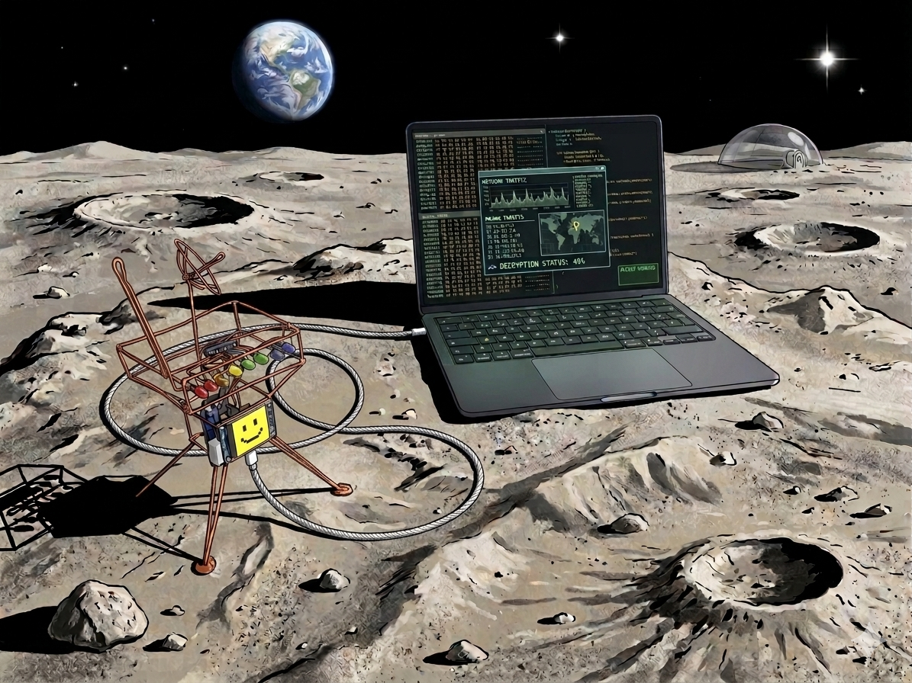

# lander001



> ✨ **Credit:** The lander sculpture is inspired by [Mohit Boite](https://bhoite.com/sculptures/)'s admittedly much prettier models.

> 🤖 **Disclaimer:** This project is mostly vibe-coded with [GitHub Copilot](https://github.com/features/copilot). Expect creative architecture decisions, occasional hallucinated APIs, and a general sense that the robot knows more than it lets on.

**lander001** is a small desk robot that reacts to your computer's notifications in real time. It runs on an ESP32-C3 and communicates with a host bridge over USB using a framed protobuf protocol. When a notification arrives — a message, an email, a calendar reminder — the robot lights up its LEDs, swings its servo-controlled antenna, and renders a notification card on its 240×240 TFT display, with app-specific icons and sender details.

The host bridge is a Rust CLI that runs on macOS or Linux and monitors the system notification stream. It translates notifications into protobuf commands and sends them to the robot, then choreographs a follow-up animation sequence entirely from the host side.

**Hardware:**

- 🧠 ESP32-C3 Super Mini
- 🖥️ ST7789 240×240 TFT display (SPI)
- 💡 74HC595 shift register driving 8 LEDs
- 📡 SG90-style servo as an antenna

### 🧰 Prerequisites

```sh
curl --proto '=https' --tlsv1.2 -sSf https://sh.rustup.rs | sh
cargo install ldproxy
cargo install espflash
```

### 🔌 Pinout

ESP32-C3 Super Mini to ST7789 240x240 TFT Display:

| Function | ESP32-C3 Pin | Display Pin | Description |
|----------|--------------|-------------|-------------|
| SCK      | GPIO4        | SCL         | SPI Clock |
| MOSI     | GPIO6        | SDA         | SPI Data Out |
| DC       | GPIO1        | DC          | Data/Command |
| RST      | GPIO0        | RST         | Reset |

ESP32-C3 Super Mini to 74HC595 Shift Register:

| Function | ESP32-C3 Pin | 74HC595 Pin | Description |
|----------|--------------|-------------|-------------|
| SER      | GPIO10       | DS (pin 14) | Serial Data Input |
| SRCLK    | GPIO21       | SH_CP (pin 11) | Shift Register Clock |
| RCLK     | GPIO20       | ST_CP (pin 12) | Storage Register Clock (Latch) |
| OE       | GND          | /OE (pin 13) | Output Enable (active low, tie to GND) |
| SRCLR    | VCC          | /MR (pin 10) | Master Reset (active low, tie to VCC) |

### 📦 Protobuf Transport (USB)

Firmware now accepts framed protobuf messages over the ESP32-C3 USB Serial/JTAG interface.

- Schema: `proto/robot.proto`
- Frame format: `magic(2='RF') + version(1) + payload_len_le(u16) + crc32_le(u32) + protobuf_payload`
- Firmware decoder and mapping: `shared/protocol.rs`

Supported protobuf payloads for now:

- `Ping` 🏓
- `SetServo` 🎯
- `LedAnimation` 🌈
- `ShowIcon` (`cat1` / `cat2` / `cat3`) 🐱
- `NotificationEvent` (mapped to LED + servo profile) 🔔

`NotificationEvent` now carries richer metadata:

- `source_bundle_id`
- `sender_name`
- `sender_handle`
- `app_icon_hint`

Firmware now sends `Ack` for each non-ack inbound message with:

- `ack.msg_id`: original inbound message ID
- `ack.ok`: success/failure
- `ack.error`: error text on failure

At the moment, `Ack` means the protobuf frame was decoded and accepted by the firmware transport/command queue. It does not wait for the full LED/display/servo behavior to finish.

Serial channel split:

- Protobuf control channel: native USB Serial/JTAG device (typically `/dev/cu.usbmodem*`)
- Runtime logs: UART0 console (typically via a USB-UART bridge, often `/dev/cu.wchusbserial*`)

This separation prevents log bytes from corrupting framed protobuf traffic.

### 🔔 Notification Rendering

Incoming `NotificationEvent` messages now render a notification card on the LCD instead of only triggering background behavior.

- 💬 WhatsApp/chat notifications: chat-style icon, green accent, sender name when available
- 📧 Mail notifications: mail icon, blue accent
- 📅 Calendar notifications: calendar icon, red accent
- ⚙️ Other notifications: generic system icon and amber accent

The robot also varies LED pattern and antenna target angle based on app/category in addition to urgency.

### 🖥️ landerctl (GUI + Headless)

The desktop host tooling is now unified in `landerctl/`.

- Default mode: GUI controller (`egui`/`eframe`) with a tray icon (macOS)
- Optional mode: headless bridge/monitor mode for notification forwarding and simulation

Tray dependency setup (required before GUI builds):

```sh
./scripts/setup_tray_item.sh
```

Run GUI mode on the host platform:

```sh
cd landerctl
cargo run
```

Run headless mode explicitly:

```sh
cargo run -- --nogui
```

Optionally pass a serial port explicitly:

```sh
cargo run -- --nogui /dev/cu.usbmodemXXXX
```

Quick simulation mode (no real incoming notifications needed):

```sh
cargo run -- --nogui --simulate whatsapp --from "Holger" --text "Coffee in 5?"
```

Other presets:

```sh
cargo run -- --nogui --simulate mail --from "Alice" --text "Please review PR #42"
cargo run -- --nogui --simulate calendar --from "Team" --text "Standup in 10 min"
cargo run -- --nogui --simulate system --from "Updater" --text "Backup completed"
```

Burst simulation:

```sh
cargo run -- --nogui --simulate whatsapp --from "Bob" --text "Ping!" --count 5 --interval-ms 800
```

On Linux, this uses `dbus-monitor` to observe `org.freedesktop.Notifications.Notify` calls and forwards them as protobuf `NotificationEvent` messages, waiting for an ACK after each send.

Firmware builds are now explicit instead of being forced globally through Cargo config. Use:

```sh
cargo fw-check
cargo fw-build
cargo fw-run
```

This mode tails the macOS unified log (`log stream`) for `usernoted` / `UserNotifications` activity, extracts a source app identifier when available, deduplicates short bursts, and forwards normalized protobuf `NotificationEvent` messages to the robot.

Current limitation: macOS does not expose full Notification Center contents through a simple stable CLI API, so this version provides strong app identification and best-effort sender extraction. For apps like WhatsApp, sender metadata is populated when it can be inferred from the available log text, but it is not guaranteed for every notification.

Current GUI features:

- serial port discovery + connect/disconnect
- ping with ACK feedback
- manual servo / LED / icon controls
- notification simulator with host-controlled follow-up animation